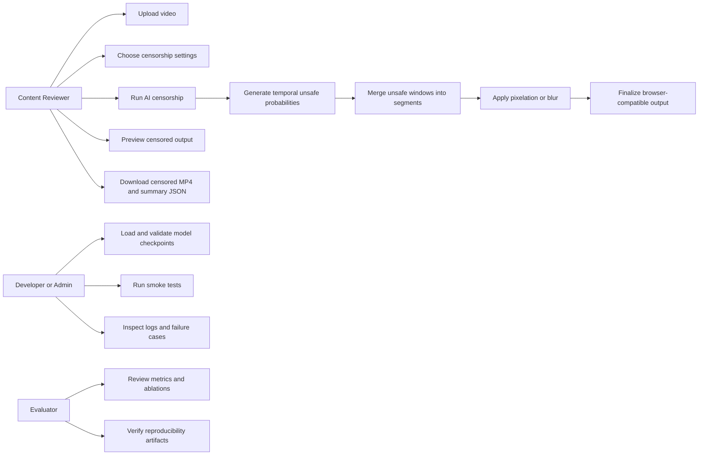
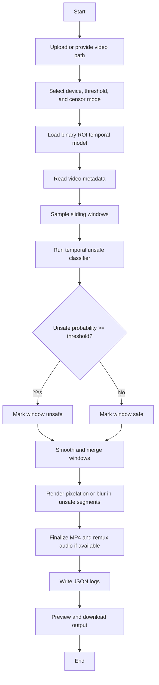
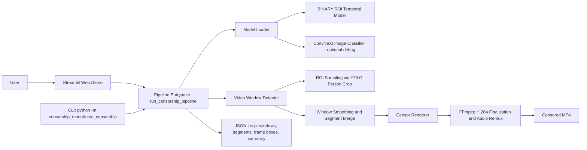
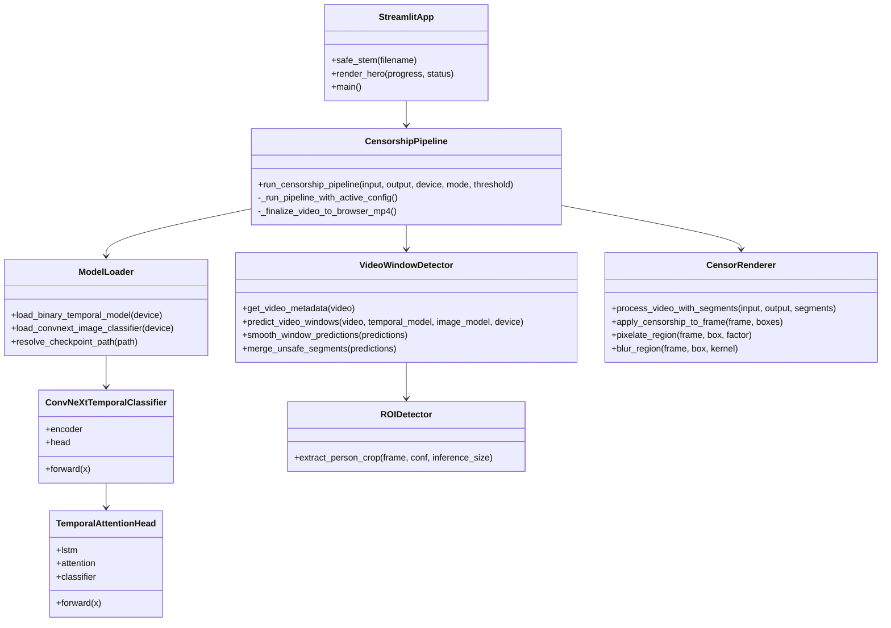
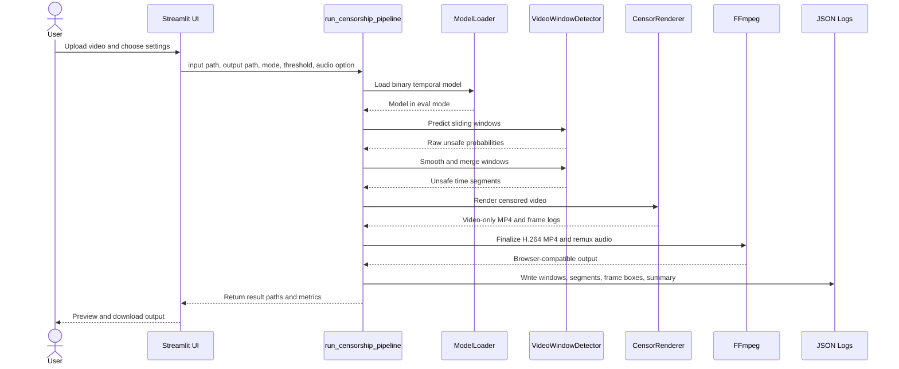

# Chapter 3: Analysis and Requirements Engineering

## 3.1 Stakeholder Analysis

The system is designed as a local AI-assisted video censorship platform for detecting unsafe visual content in videos and producing a censored output. The stakeholders are not limited to the end user who uploads a video; the system also affects reviewers, developers, evaluators, and people represented in the datasets.

| Stakeholder | Role | Main concern | System implication |
|---|---|---|---|
| End user/content reviewer | Uploads videos and reviews censored output | Fast, understandable, downloadable results | The system must provide a simple UI, progress feedback, output preview, and summary logs |
| System administrator/developer | Maintains models, checkpoints, and runtime environment | Reproducibility, robustness, and clear failure handling | The system must load checkpoints safely, log outputs, and avoid hidden dependency downloads |
| Thesis evaluator/supervisor | Assesses technical contribution and evidence | Validated claims, metrics, architecture, and limitations | The thesis must separate final accepted modules from exploratory or rejected experiments |
| Dataset subjects/content creators | People appearing in visual content | Fair treatment, privacy, and bias reduction | The model must avoid systematic over-censorship of safe body-related content |
| Moderation organization | Potential deployer of the system | Accuracy, latency, auditability, and risk control | The system must produce explainable evidence files and allow threshold calibration |
| Research community | Future developers extending the project | Clear baselines and reproducibility | The project must document datasets, preprocessing, hyperparameters, and unsupported claims |

The most important stakeholder conflict is between safety and preservation of normal content. A low threshold catches more unsafe segments but may over-censor safe videos. A high threshold preserves more safe content but increases the risk of missed unsafe material. The final system therefore uses threshold tuning, macro-F1, unsafe recall, and confusion matrices rather than accuracy alone.

## 3.2 Functional Requirements (Use Case Modelling)

The functional requirements are linked directly to the model outputs and the deployed pipeline behavior. The final system is expected to classify video windows as safe or unsafe, merge unsafe windows into segments, render censorship, and provide evidence logs.

### Use Case Diagram



### Functional Requirements

| ID | Requirement | ML output link | Acceptance criterion |
|---|---|---|---|
| FR-1 | The system shall accept a local video file through the Streamlit interface or CLI. | Input is passed to the inference pipeline. | Supported input formats include MP4, MOV, AVI, and MKV in the local demo. |
| FR-2 | The system shall sample each video into overlapping temporal windows. | Each 4-second window is represented by 16 sampled frames. | Window metadata must be written to the windows JSON file. |
| FR-3 | The system shall classify each video window as safe or unsafe. | The temporal model outputs `temporal_unsafe_prob`. | A window is unsafe when `temporal_unsafe_prob >= 0.50` by default. |
| FR-4 | The system shall expose the model confidence/probability for audit. | Unsafe probability and fused score are saved per window. | Summary and window logs must include maximum unsafe probability and per-window scores. |
| FR-5 | The system shall mark high-confidence unsafe windows for review. | Probabilities near 1.0 indicate stronger unsafe evidence. | Windows with unsafe probability above 0.90 can be interpreted as high-confidence unsafe evidence in logs. |
| FR-6 | The system shall merge adjacent unsafe windows into temporal segments. | Binary unsafe decisions are post-processed. | Unsafe segments must include start time, end time, and maximum unsafe probability. |
| FR-7 | The system shall censor frames inside unsafe segments. | Segment output controls renderer behavior. | Frames inside unsafe segments are pixelated or blurred; frames outside segments remain unchanged. |
| FR-8 | The system shall provide selectable censorship style. | Rendering is separate from model prediction. | The user can choose pixelation or blur without retraining the model. |
| FR-9 | The system shall preserve original audio when possible. | Audio is not used as final classifier input. | If ffmpeg and input audio are available, audio is remuxed into the output MP4. |
| FR-10 | The system shall generate evidence artifacts. | Model outputs and rendering metadata are serialized. | The pipeline writes windows, segments, frame boxes, and summary JSON files. |
| FR-11 | The system shall prevent unsupported model claims in the final UI. | Final path is visual temporal only. | Audio fusion, profanity, and violence models are not exposed as accepted final modules. |
| FR-12 | The system shall support checkpoint-based reproducible inference. | Model loader resolves and validates checkpoints. | Loading fails clearly if required checkpoint keys do not match. |

### Activity Diagram



## 3.3 Non-Functional Requirements

Non-functional requirements define whether the system is usable, reliable, and suitable for a responsible AI demonstration.

| ID | Requirement | Rationale | Evidence or design response |
|---|---|---|---|
| NFR-1 Latency | The system should process videos in practical demo time. | Users need feedback while waiting. | Streamlit shows progress stages; CUDA is used when available. A smoke-test run processed 18,001 frames in about 279.8 seconds. |
| NFR-2 Accuracy balance | The system should optimize macro-F1 and unsafe recall, not accuracy alone. | Unsafe and safe errors have different costs. | Final threshold is selected from a threshold sweep; final macro-F1 is 0.7506 and unsafe recall is 0.8586. |
| NFR-3 Robustness | The system should survive corrupt images, missing ROI detections, and missing ffmpeg. | Real media files are noisy. | `collate_skip_none`, ROI fallback, checkpoint validation, and ffmpeg fallback paths are implemented. |
| NFR-4 Auditability | The system should produce machine-readable evidence for each run. | Reviewers need to know why a video was censored. | Windows, segments, frame boxes, and summary JSON files are written for each run. |
| NFR-5 Modularity | UI, model loading, detection, and rendering should be decoupled. | Supports testing and future replacement of components. | Streamlit calls `run_censorship_pipeline`; inference modules live in `censorship_module/`. |
| NFR-6 Reproducibility | Environment, checkpoints, and major parameters should be documented. | Thesis results must be verifiable. | Evidence bundle includes `requirements.txt`, `environment.yml`, checkpoint paths, and metric logs. |
| NFR-7 Safety | The final demo should avoid under-censoring unsafe segments. | Missed unsafe content is the higher-risk failure. | Default rendering is full-frame censorship within unsafe temporal segments. |
| NFR-8 Privacy | The system should operate locally without uploading media to external services. | Input videos may be sensitive. | The implemented demo runs locally with local checkpoints and local ffmpeg. |
| NFR-9 Maintainability | Unsupported experiments should not be promoted into the final system. | Prevents misleading product behavior. | Audio fusion is documented as rejected; profanity and violence datasets are not claimed as trained models. |

The latency-versus-accuracy trade-off is central. ROI temporal inference is slower than a frame-only model because it samples multiple frames and may run person ROI extraction. However, this cost is justified by improved temporal stability and a macro-F1 improvement over the full-frame temporal baseline.

## 3.4 Data Requirements

The data requirements specify the sources, expected volume, diversity, label standards, noise tolerance, and class balance needed by the system. These requirements are important because the final model is only as reliable as the training and validation data used to evaluate it.

### 3.4.1 Data Sources and Acquisition

The project uses several local datasets. The final evidence-backed system depends mainly on the NudeNet classifier image dataset, normal hard negatives, and Dataset 2 video samples.

| Source | Role in project | Required properties |
|---|---|---|
| NudeNet classifier dataset v1 x320 | Trains and evaluates the 3-class ConvNeXt image backbone | Large-scale image variety across normal, suggestive, and nude/unsafe labels |
| Normal hard negatives | Reduces false unsafe predictions on visually ambiguous safe content | Safe images with exposed skin, sports, body poses, or similar visual patterns |
| Dataset 2 Censora movies/tvshows | Trains and validates temporal censorship model | Video clips labelled Normal, Medium, and Extreme, grouped by video ID |
| Explicit audio folder | Exploratory audio fusion only | Reference positives, train-only, not validation |
| TAPAD and XDViolence | Dataset presence only | Not part of final model due lack of trained checkpoint and metrics |

The acquisition policy for final claims is evidence-based: a dataset can be mentioned as present, but it can only support a final thesis claim if there is a trained checkpoint, metrics, and implementation evidence.

### 3.4.2 Data Volumetric and Diversity Requirements

The final image backbone requires large-scale image data because unsafe visual classification has high visual diversity. The project uses 711,317 images in the NudeNet dataset split:

| Split | Safe | Suggestive/Sexy | Nude/Unsafe | Total |
|---|---:|---:|---:|---:|
| Training | 222,448 | 38,004 | 430,510 | 690,962 |
| Validation | 4,058 | 2,248 | 4,000 | 10,306 |
| Test | 4,050 | 2,121 | 3,878 | 10,049 |

The hard-negative set adds 813 normal training images. Its role is not raw volume but targeted diversity. It captures safe cases that resemble unsafe content and directly reduces over-censorship.

Dataset 2 provides 741 temporal video records:

| Split | Safe/Normal | Medium | Extreme | Binary Safe | Binary Unsafe |
|---|---:|---:|---:|---:|---:|
| Train | 263 | 119 | 211 | 263 | 330 |
| Validation | 49 | 58 | 41 | 49 | 99 |

Class balance requirement:

- The system must report class counts for every final training and validation split.
- Binary temporal training should use class weights when imbalance exists.
- Evaluation must include macro-F1 and class recall because accuracy can hide minority-class failures.
- Validation should include both Medium and Extreme unsafe content, since the final binary unsafe class combines them.

Noise tolerance requirement:

- Corrupt or unreadable images must be skipped without crashing a training batch.
- Missing or failed ROI detections must fall back to full-frame sampling.
- Dataset 2 labels must be treated as video-level labels, not clean frame-level labels.
- Audio labels must be treated as weak and exploratory unless clean audio-specific annotation is available.

### 3.4.3 Data Annotation and Labelling Standards

The project uses three label schemes.

Image backbone labels:

- `normal`: safe image content
- `sexy` or suggestive: borderline/suggestive content
- `nude`: unsafe visual content

Temporal Dataset 2 labels:

- `0`: Normal/Safe
- `1`: Medium unsafe
- `2`: Extreme unsafe

Final binary temporal mapping:

- `0`: Safe/Normal
- `1`: Unsafe, where Medium and Extreme are merged

The binary mapping is justified by the deployed task. The renderer needs to decide whether to censor a time segment. It does not need to output a fine-grained severity class during final inference.

Annotation standards for future data collection should include:

- Video-level labels and, where possible, segment-level start/end labels
- Clear distinction between safe exposed-skin contexts and unsafe nudity/sexual contexts
- Separate labels for ambiguous or borderline content
- Demographic or categorical metadata where ethically collectable, so fairness can be measured directly
- Consistent guidelines for Medium versus Extreme, or else a binary safety label if severity cannot be labelled reliably

# Chapter 4: System Architecture and Design

## 4.1 High-Level System Architecture

The implemented system is a modular AI-assisted video censorship platform. Its purpose is to receive a video, detect unsafe temporal regions, render censorship only during those regions, and produce a browser-compatible censored output with JSON evidence logs. The architecture separates the user interface from the AI pipeline, allowing the trained models and inference modules to be used from both a Streamlit demo and a command-line workflow.

The final supported production path is visual and temporal. It uses a ConvNeXt-Small image backbone and a binary ROI-aware temporal classifier. Audio fusion, profanity detection, and violence detection are present only as datasets or exploratory experiments and are not claimed as final accepted modules.



The system follows a pipeline architecture. The Streamlit interface in `Implimentation/app.py` is responsible for upload, settings, progress updates, preview, and download. It does not implement the model logic directly. The AI and rendering logic is encapsulated in `Implimentation/censorship_module/`, especially `run_censorship.py`, `model_loader.py`, `video_window_detector.py`, and `censor_renderer.py`.

The final inference configuration is safety-first:

- Temporal model: `checkpoints/binary_temporal_roi_best.pt`
- Image backbone checkpoint: `checkpoints/convnext_sexynude_hardneg_best.pt`
- Clip length: 16 sampled frames
- ROI confidence threshold: 0.25
- ROI inference size: 320
- Window length: 4.0 seconds
- Window stride: 2.0 seconds
- Temporal unsafe threshold: 0.50
- Default fusion policy: `temporal_only`
- Default censorship region: `full_frame`
- Default censorship style: pixelation, with blur also supported

This architecture was selected because video censorship requires temporal stability. Frame-only classification can create flickering decisions and can miss unsafe context across adjacent frames. The temporal model makes decisions over windows, then post-processing merges unsafe windows into stable intervals.

## 4.2 Component Design

The implementation is organized around independent components with narrow responsibilities.

| Component | Source file | Responsibility |
|---|---|---|
| Web application | `Implimentation/app.py` | Local Streamlit dashboard, upload handling, UI settings, progress display, result preview and downloads |
| Pipeline orchestrator | `censorship_module/run_censorship.py` | Runs model loading, window prediction, smoothing, segment merging, rendering, ffmpeg finalization, and JSON logging |
| Model loader | `censorship_module/model_loader.py` | Resolves checkpoints, loads ConvNeXt temporal and image models, validates checkpoint compatibility |
| Window detector | `censorship_module/video_window_detector.py` | Reads metadata, samples sliding video windows, runs temporal inference, smooths scores, merges unsafe segments |
| ROI detector | `pipelines/roi_detector.py` | Uses local YOLOv8n person detection to crop the main person/body region for ROI-aware temporal training and inference |
| Temporal model | `Models/temporal_model.py` | ConvNeXt encoder plus LSTM or attention temporal head |
| Renderer | `censorship_module/censor_renderer.py` | Applies pixelation or blur to selected frames and writes frame-level logs |
| Optional debug localization | `censorship_module/patch_heatmap_localizer.py` | Weak patch heatmap localization for debugging only, not final thesis claim |
| Data utilities | `porn_data.py`, `temporal_dataset2_loader.py` | Image and temporal dataset loading, label remapping, LMDB support, safe collate functions |

### Class Diagram



### Sequence Diagram



## 4.3 The AI Pipeline Architecture

The AI pipeline is divided into training-time and inference-time paths. Training is mainly notebook-driven through `Implimentation/PORNMODULE.ipynb`, supported by reusable dataset and model files. Inference is implemented as a standalone module and can run from Streamlit or CLI.

### 4.3.1 Data Ingestion and ETL

The project uses multiple datasets, but only a subset is part of the final evidence-backed solution.

| Dataset | Purpose | Final status |
|---|---|---|
| NudeNet classifier dataset v1 x320 | Three-class image classifier: normal, suggestive/sexy, unsafe/nude | Final image backbone |
| Normal hard negatives | Normal images that previously triggered unsafe false positives | Final augmentation |
| Dataset 2 Censora movies/tvshows | Temporal video training and validation | Final binary ROI temporal model |
| Dataset 3 reconstructed clips | Exploratory ordinal clip experiments | Not final |
| Explicit audio folder | Weak audio reference for fusion experiments | Exploratory, rejected |
| TAPAD profanity audio dataset | Dataset present only | Not used in final model |
| XDViolence | Dataset present only | Not used in final model |

For the image model, data is ingested from large image folders and LMDB-backed storage. The code supports corrupted-image skipping through `SafeImageFolder`, `LMDBDataset`, and `collate_skip_none`. Images are transformed into RGB tensors resized to 224 x 224.

For Dataset 2 videos, the temporal loader groups records by `video_id` to avoid leakage between train and validation. The final split uses GroupKFold by `video_id`, with 593 training records and 148 validation records. The final binary label mapping is:

- 0: Safe/Normal
- 1: Unsafe, merging Medium and Extreme

This binary mapping was chosen because the three-class temporal severity experiments were less stable and produced lower macro-F1 on Dataset 2.

### 4.3.2 Preprocessing and Feature Engineering Modules

The core preprocessing modules are image resizing, temporal frame sampling, ROI extraction, temporal augmentation, and optional audio feature extraction.

Image preprocessing:

- Resize to 224 x 224
- Convert RGB images to tensors in `[0, 1]`
- Use matched preprocessing between the image backbone and temporal model
- Training augmentation: RandomResizedCrop, RandomHorizontalFlip, and ColorJitter
- Validation transform: Resize to 224 x 224 and ToTensor

Temporal preprocessing:

- Each video sample is converted into a 16-frame clip
- Frames are sampled across the clip/window to preserve temporal coverage
- Short clips are padded by repeating the final available frame
- Dataset 2 is split by video group to avoid same-video leakage
- Temporal dropout is applied during training with probability 0.5 and fraction `T//6`

ROI feature engineering:

- The ROI detector uses local YOLOv8n person detection
- The largest person box is selected
- The selected crop is passed to the temporal model
- If ROI extraction fails in `auto` mode, the pipeline falls back to full-frame sampling and logs the fallback

The ROI decision is a domain-driven feature engineering choice. Unsafe visual content is usually concentrated on human subjects. Cropping the main person region reduces background noise and helps the temporal model focus on relevant body-region evidence.

Audio feature engineering was evaluated but rejected for final production. The audio section extracted handcrafted audio statistics such as RMS, silence ratio, zero-crossing rate, spectral centroid, spectral bandwidth, spectral rolloff, FFT bands, mel bands, and MFCC-like coefficients. However, the final audio fusion summary rejected audio because it did not improve macro-F1 by the required margin and reduced unsafe recall.

### 4.3.3 Model Training and Validation Workflows

The project follows an iterative workflow:

1. Train a three-class ConvNeXt-Small image classifier on normal, suggestive, and nude/unsafe images.
2. Evaluate the image backbone on validation and test sets.
3. Add 813 hard-negative normal examples to reduce false unsafe predictions.
4. Use the hard-negative ConvNeXt checkpoint as the encoder for temporal experiments.
5. Compare three-class temporal, ordinal temporal, multitask temporal, binary temporal, and ROI-aware binary temporal variants.
6. Select the binary ROI temporal model based on macro-F1, unsafe recall, and safe recall.
7. Freeze the final temporal checkpoint and integrate it into the censorship module.

The final temporal model is `ConvNeXtTemporalClassifier` with:

- ConvNeXt-Small encoder
- Attention temporal head with bidirectional LSTM
- Binary output classes
- Frozen image encoder
- Class weights for binary imbalance
- Batch size 1 with gradient accumulation 2
- Mixed precision enabled when CUDA is available
- Gradient clipping at norm 5.0

Validation is performed with threshold sweeps from 0.30 to 0.60. The selected final threshold is 0.50 because it produced the best macro-F1 while maintaining high unsafe recall.

### 4.3.4 Inference Engine and API Integration

The inference engine is implemented in `censorship_module/run_censorship.py`. It exposes `run_censorship_pipeline`, which acts as the local API boundary between the UI and the AI pipeline.

Inference plan:

1. Receive input video path, output path, device, censorship mode, threshold, and audio preservation option.
2. Load the binary ROI temporal checkpoint with strict checkpoint compatibility checks.
3. Read video metadata using OpenCV.
4. Slide a 4-second window over the video with 2-second stride.
5. For each window, sample 16 frames and optionally crop the main person ROI.
6. Run the binary temporal model to estimate `temporal_unsafe_prob`.
7. Use the default `temporal_only` policy, where a window is unsafe if `temporal_unsafe_prob >= 0.50`.
8. Smooth nearby window predictions using a smoothing window of 3.
9. Merge unsafe windows into continuous unsafe segments with a 0.5 second merge gap.
10. Render censorship for frames inside the unsafe segments.
11. Finalize the output MP4 with ffmpeg using H.264, `yuv420p`, and `+faststart`.
12. Remux original audio when present and when audio preservation is enabled.
13. Save four evidence files: windows JSON, segments JSON, frame boxes JSON, and summary JSON.

The production-oriented decision is to use full-frame censorship within unsafe temporal segments. Although patch and person-body modes exist for debugging, the final demo does not claim precise segmentation. Full-frame censorship reduces localization risk and favors safety over visual selectivity.

## 4.4 Technology Stack Selection

| Layer | Technology | Justification |
|---|---|---|
| Programming language | Python 3.10.12 | Strong ML ecosystem and compatibility with PyTorch, OpenCV, Streamlit, and notebook workflows |
| Deep learning | PyTorch 2.11.0, torchvision | Flexible model training and checkpoint handling |
| Backbone models | timm ConvNeXt-Small | Strong image representation, good transfer learning performance, supports feature extraction |
| Temporal modeling | LSTM/attention head | Captures motion and temporal context over sampled video clips |
| ROI detection | Ultralytics YOLOv8n, local weights | Fast person ROI extraction, improves signal-to-noise for human-centered unsafe content |
| Video processing | OpenCV | Frame extraction, rendering, pixelation, blur, and video writing |
| Media finalization | ffmpeg/ffprobe | H.264 browser-compatible output and audio remux |
| UI | Streamlit | Rapid local demo with upload, progress, preview, and downloads |
| Experiment tracking | JSON and CSV logs | Lightweight reproducibility and thesis evidence |
| Storage | LMDB and filesystem datasets | Efficient large-scale image access and direct video storage |
| Hardware acceleration | CUDA on NVIDIA RTX 4070 Laptop GPU | Required to make temporal video inference and training practical |

The main architectural trade-off is latency versus accuracy. The ROI temporal model is slower than a frame-only classifier because it samples multiple frames and may run person ROI extraction, but it improves temporal stability and validation performance. The final renderer uses full-frame censorship to reduce the risk of missed regions and avoid expensive patch localization during normal demo inference.

# Chapter 5: ML Methodology and Implementation

## 5.1 Data Preprocessing Techniques

The project applies different preprocessing pipelines for image classification, temporal classification, and inference.

For image classification, all images are normalized into a consistent RGB 224 x 224 tensor format with values in `[0, 1]`. The hard-negative image model uses the same core preprocessing as the baseline but adds normal hard negatives to the training data. These hard negatives are visually ambiguous normal images, such as athletic or skin-exposed images, that previously caused high unsafe predictions.

For temporal classification, each video is sampled into a 16-frame clip. The temporal loader handles videos with too few frames by repeating the last available frame, which prevents shape errors and keeps batch tensors consistent. During training, consistent transforms are applied across frames so that augmentation does not create unnatural frame-to-frame jitter.

For ROI-aware temporal training, frames are passed through a local YOLOv8n person detector. The largest detected person crop is used as the model input. If no person is detected, the original full frame is retained. This gives the model a focused representation while preserving fallback behavior.

For inference, the video is decomposed into overlapping 4-second windows with 2-second stride. Each window is sampled into 16 frames, scored by the temporal model, smoothed with neighboring windows, and merged into unsafe segments. This avoids treating isolated frames as independent decisions.

## 5.2 Model Selection and Justification

The final model selection was based on comparative experiments rather than a single training run.

The image backbone is ConvNeXt-Small because it provides strong visual features for fine-grained image classification. It outperformed simpler hand-crafted feature approaches implicitly by learning body, pose, texture, and scene-level visual evidence directly from a large labeled dataset. The final hard-negative tuned ConvNeXt-Small achieved validation macro-F1 0.8824 and test macro-F1 0.8878.

The temporal model uses ConvNeXt features plus an attention-based recurrent head. A frame-only classifier is insufficient for video censorship because unsafe scenes often require temporal context, and frame-level decisions can flicker. The temporal model aggregates evidence across 16 sampled frames, while the attention head learns which frames contribute most to the decision.

The final accepted temporal model is the binary ROI temporal classifier. It was selected over:

- Full-frame binary temporal baseline
- Three-class temporal classifier
- Ordinal temporal severity models
- Multitask temporal models
- Dataset3-only clip transfer models
- Audio-aware late fusion experiments

The final binary ROI temporal model achieved macro-F1 0.7506, accuracy 0.7838, safe recall 0.6327, and unsafe recall 0.8586 on Dataset 2 validation. Compared with the full-frame temporal baseline, ROI-aware inference improved macro-F1 by 0.0650 and unsafe recall by 0.0606.

Audio fusion was rejected. The best audio rule-gated candidate reached macro-F1 0.7543, only 0.0037 above the visual baseline, while reducing unsafe recall by about 0.0505. This is not acceptable for a censorship system where false-safe errors are costly.

## 5.3 Feature Engineering and Selection

The main feature engineering contribution is ROI-aware temporal sampling. The model does not receive only generic full-frame frames; instead, it receives person-focused crops when available. This follows the domain observation that unsafe content in the target problem is usually associated with human body regions and not arbitrary background pixels.

The second important feature engineering decision is hard-negative normal augmentation. The project identified a failure mode where normal images with exposed skin, sports, or similar visual patterns were wrongly predicted as unsafe. Adding 813 hard-negative normal images reduced unsafe predictions on this hard-negative set from 66.91 percent to 3.81 percent.

The third decision is binary label merging for Dataset 2. Dataset 2 contains Normal, Medium, and Extreme labels, but the final censorship problem is operationally binary: censor or do not censor. The Medium and Extreme classes were merged into Unsafe. This reduced severity-label ambiguity and improved stability compared with three-class temporal severity models.

Optional audio features were engineered but not selected. Audio features included energy, silence, spectral and MFCC-like statistics. The results showed that the Dataset 2 labels are video labels, not clean audio labels, so audio behaved as weak noisy context rather than reliable signal.

## 5.4 Hyperparameter Optimisation Strategy

The optimization strategy was empirical and ablation-driven. The project did not log every optimizer hyperparameter for the final temporal run, so this chapter reports only parameters supported by source code or experiment logs.

Final temporal configuration:

| Parameter | Value |
|---|---|
| Model | ConvNeXtTemporalClassifier |
| Encoder | ConvNeXt-Small |
| Temporal head | Attention head with bidirectional LSTM |
| Classes | Binary Safe/Unsafe |
| Clip length | 16 frames |
| Image size | 224 x 224 |
| ROI enabled | Yes |
| ROI confidence | 0.25 |
| ROI inference size | 320 |
| Batch size | 1 |
| Gradient accumulation | 2 |
| Effective batch size | 2 |
| Encoder frozen | Yes |
| Encoder chunk size | 4 |
| Mixed precision | Enabled on CUDA |
| Gradient clip norm | 5.0 |
| Temporal dropout probability | 0.5 |
| Best epoch | 18 |
| Final threshold | 0.50 |

Threshold search space:

`0.30, 0.35, 0.40, 0.45, 0.50, 0.55, 0.60`

The selected threshold 0.50 produced the best macro-F1. Lower thresholds increased unsafe recall but created more false positives on normal videos. Higher thresholds reduced normal false positives but increased unsafe false negatives. This threshold sweep directly reflects the latency/accuracy/safety trade-off in a censorship system.

## 5.5 Software Implementation Details

Several implementation patterns make the software practical and reproducible.

Pipeline pattern: `run_censorship_pipeline` acts as the orchestration boundary. It receives input settings, applies temporary configuration overrides, and restores settings after execution. This prevents UI runs from leaking configuration into later runs.

Factory/loading pattern: `model_loader.py` resolves checkpoints from common paths, unwraps checkpoint state dictionaries, strips common prefixes, checks tensor shape compatibility, and refuses to continue if too few weights match. This reduces silent checkpoint loading errors.

Fallback pattern: ROI extraction can run in `auto`, `yolo`, or `none` mode. In `auto`, missing ROI support falls back to full-frame sampling and logs the fallback. This keeps inference robust on machines where optional ROI dependencies are unavailable.

Evidence logging pattern: every inference writes windows, segments, frame boxes, and summary JSON files. These files are useful for debugging, user reporting, and thesis evidence.

Safety-first rendering pattern: the default final mode censors full frames inside unsafe segments. This avoids overclaiming region localization and reduces the risk that partial censorship leaves unsafe content visible.

# Chapter 6: Experimental Design and Evaluation

## 6.1 Experimental Setup

The final evidence bundle reports the following environment:

| Item | Value |
|---|---|
| OS | Linux 6.8.0-117-generic |
| Python | 3.10.12 |
| PyTorch | 2.11.0+cu130 |
| CUDA | 13.0 |
| GPU | NVIDIA GeForce RTX 4070 Laptop GPU |
| Image size | 224 x 224 |
| Temporal clip length | 16 frames |
| Final temporal batch size | 1 |
| Gradient accumulation | 2 |
| Effective batch size | 2 |

The final temporal model was trained on Dataset 2 using GroupKFold by `video_id`. The final split contained 593 training records and 148 validation records. Validation contained 49 safe records and 99 unsafe records.

## 6.2 Baselines and Comparative Benchmarks

The project compares the final model against several credible baselines.

| Experiment | Macro-F1 | Unsafe recall | Decision |
|---|---:|---:|---|
| Full-frame binary temporal baseline | 0.6856 | 0.7980 | Rejected |
| Binary ROI temporal model | 0.7506 | 0.8586 | Accepted |
| Audio fusion with binary ROI | 0.7543 | 0.8081 | Rejected |
| Ordinal temporal severity | 0.5029 | Not logged | Rejected |
| Temporal matched preprocessing three-class | 0.4365 | Not logged | Rejected |
| Dataset3 clips tested on Dataset2 | 0.3364 | Not logged | Rejected |
| Multitask temporal experiment | 0.3423 | Not logged | Rejected |

The strongest supported result is the ROI ablation. ROI-aware temporal sampling improved macro-F1 by 0.0650 over the full-frame binary temporal baseline and improved unsafe recall by 0.0606.

The image backbone benchmark also supports the final system. The ConvNeXt-Small baseline achieved validation macro-F1 0.8784, while the hard-negative tuned model improved validation macro-F1 to 0.8824 and test macro-F1 to 0.8878.

## 6.3 Evaluation Metrics

The project uses metrics beyond accuracy because the data is imbalanced and false-safe errors are more serious than false-unsafe errors.

The main metrics are:

- Accuracy: overall fraction of correct predictions
- Precision: reliability of a positive prediction
- Recall: ability to detect all examples in a class
- F1-score: harmonic mean of precision and recall
- Macro-F1: unweighted average F1 across classes
- Unsafe recall: ability to detect unsafe content
- Confusion matrix: direct error count by true and predicted label

Final binary ROI temporal metrics:

| Metric | Value |
|---|---:|
| Accuracy | 0.7838 |
| Macro precision | 0.7571 |
| Macro recall | 0.7456 |
| Macro-F1 | 0.7506 |
| Safe precision | 0.6889 |
| Safe recall | 0.6327 |
| Unsafe precision | 0.8252 |
| Unsafe recall | 0.8586 |

Confusion matrix for the final binary ROI temporal model:

|  | Predicted Safe | Predicted Unsafe |
|---|---:|---:|
| True Safe | 31 | 18 |
| True Unsafe | 14 | 85 |

The threshold sweep shows the core trade-off. At threshold 0.30, unsafe recall rises to 0.9192 but false positives increase to 29. At threshold 0.60, false positives drop to 14 but unsafe recall falls to 0.7980. The selected threshold 0.50 balances macro-F1 and unsafe recall.

## 6.4 Ablation Studies

### Hard-Negative Augmentation

The hard-negative experiment tested whether adding difficult normal examples reduces false unsafe predictions. On 813 matched hard-negative normal images:

- Unsafe prediction rate before tuning: 66.91 percent
- Unsafe prediction rate after tuning: 3.81 percent
- Predicted nude before: 483
- Predicted nude after: 18
- Delta unsafe percent: -63.10 percentage points

This ablation directly addresses a failure mode where normal but visually ambiguous content was treated as unsafe.

### ROI-Aware Temporal Sampling

The ROI ablation compared the full-frame binary temporal model with the ROI-aware binary temporal model on the same Dataset 2 split.

| Model | Macro-F1 | Safe recall | Unsafe recall |
|---|---:|---:|---:|
| Full-frame binary temporal | 0.6856 | 0.5714 | 0.7980 |
| ROI-aware binary temporal | 0.7506 | 0.6327 | 0.8586 |
| Delta | +0.0650 | +0.0613 | +0.0606 |

The result supports ROI-aware sampling as the most important temporal improvement.

### Binary Merge Versus Three-Class Severity

Three-class and ordinal temporal experiments were explored, but they underperformed the final binary ROI approach. The binary merge fits the application objective more closely: the deployed system needs to decide whether a segment should be censored, not necessarily estimate a fine-grained severity class.

### Audio Fusion

Audio fusion was evaluated as an optional late-fusion experiment. The best numeric candidate, `rule_gated_alpha_+0.3`, had macro-F1 0.7543, but unsafe recall fell to 0.8081 from the visual baseline's 0.8586. The final decision was `REJECT_AUDIO` because the macro-F1 gain was only +0.0037 and unsafe recall decreased.

## 6.5 Statistical Significance Testing

The project contains one matched before/after prediction file suitable for significance testing: the hard-negative normal set. An exact McNemar test was applied to 813 paired hard-negative examples.

| Outcome | Count |
|---|---:|
| Unsafe before, safe after | 519 |
| Safe before, unsafe after | 6 |
| Unsafe before | 544 |
| Unsafe after | 31 |
| Exact McNemar p-value | 5.206e-145 |

This indicates that the reduction in hard-negative false unsafe predictions is statistically significant.

For the ROI temporal ablation, the available project evidence logs aggregate confusion matrices and threshold rows but do not preserve enough paired baseline-vs-ROI per-sample predictions to run a valid McNemar test. Therefore, the thesis should present the ROI result as a strong ablation improvement on the same validation split, while noting that a paired significance test should be added once both baseline and ROI predictions are saved with stable sample IDs.

# Chapter 7: Results and Discussion

## 7.1 Analysis of Experimental Results

The final accepted model is the binary ROI temporal classifier. It achieved macro-F1 0.7506 and unsafe recall 0.8586 on Dataset 2 validation. The model improved over the full-frame binary temporal baseline by +0.0650 macro-F1 and +0.0606 unsafe recall. This confirms that ROI-aware temporal sampling improves the model's ability to detect unsafe scenes.

The image classifier results support the temporal pipeline. Hard-negative tuning improved validation macro-F1 from 0.8784 to 0.8824 and test macro-F1 from 0.8745 to 0.8878. More importantly, it reduced false unsafe predictions from normal hard-negative images, which is directly relevant to a censorship system where over-censoring normal content damages user trust.

The audio fusion results were negative but valuable. They showed that weak audio features did not provide a reliable production improvement. This prevents the final architecture from becoming unnecessarily complex.

## 7.2 Performance Breakdown

The final binary ROI model produced the following validation error pattern:

- 18 safe/normal videos were predicted unsafe
- 14 unsafe videos were predicted safe
- Medium unsafe recall: 0.8103
- Extreme unsafe recall: 0.9268

The model performs better on Extreme unsafe content than Medium unsafe content. This is expected because Extreme examples usually contain clearer visual evidence, while Medium examples may include subtler, shorter, or more ambiguous content. The remaining false-safe errors are therefore concentrated in the harder boundary cases.

False positives still exist. The safe recall of 0.6327 means that some safe videos are censored. In the context of a safety-focused censorship tool, this may be acceptable for a demo because the system prioritizes avoiding missed unsafe content. However, in a production moderation workflow, over-censorship should be reduced further through larger safe validation sets, improved hard-negative video mining, and calibrated thresholds per use case.

The threshold sweep demonstrates this trade-off:

- Lower threshold: catches more unsafe content but censors more safe content
- Higher threshold: preserves more safe content but misses more unsafe content
- Selected threshold 0.50: best macro-F1 in the logged sweep

## 7.3 Implications for Software Engineering Practice

The project shows that ML systems should be engineered as modular pipelines rather than tightly coupled notebooks. The final implementation decouples the UI from inference, keeps model loading separate from rendering, and writes structured JSON logs. This makes the system easier to test, debug, and demonstrate.

The project also shows the value of evidence-backed scope control. Several components were explored, including audio fusion, patch localization, profanity datasets, and violence datasets. However, unsupported or rejected modules were not promoted into the final claim. This is a strong software engineering practice because it prevents feature claims from exceeding validated behavior.

The final full-frame censorship policy is also a practical engineering decision. Precise localization is more visually elegant, but missed regions are risky. Full-frame censorship during unsafe temporal segments is simpler, faster, and safer for the final demo.

## 7.4 Limitations of the Current Approach

The current system has several important limitations.

First, the final model is visual-only. Audio fusion was explored but rejected, and no trained profanity or violence model is supported by checkpoint and metric evidence.

Second, final censorship is full-frame within unsafe segments. This is safe for a demo but may be visually heavy. Patch heatmap and person-body modes exist in code, but they are debug or approximate modes and should not be claimed as precise segmentation.

Third, segment-level audio muting is not implemented. The system can preserve/remux original audio using ffmpeg, but it does not mute unsafe intervals.

Fourth, the final Dataset 2 validation set is relatively small with 148 validation records. The results are useful for a graduation project, but production deployment would require larger and more diverse validation data.

Fifth, the ROI temporal ablation lacks a stored paired-prediction significance test. The aggregate improvement is clear, but future experiments should save per-sample predictions for all baselines so McNemar or bootstrap confidence intervals can be computed.

Finally, the model still struggles with Medium unsafe cases and safe videos that visually resemble unsafe content. Future work should focus on video hard-negative mining, better temporal annotation, calibrated thresholds for different risk policies, and stronger temporal architectures once latency constraints permit.

Overall, the final system demonstrates a realistic engineering balance: it favors a validated, modular, safety-first temporal censorship pipeline over unvalidated multimodal complexity.

# Chapter 8: Conclusion and Future Work

## 8.1 Summary of Contributions

This project designed, implemented, and evaluated a modular AI-assisted video censorship system. The final supported system receives a video, detects unsafe temporal segments using a binary ROI-aware temporal classifier, censors frames inside those unsafe segments, preserves audio when possible, and writes structured JSON logs for auditability.

The main contributions are:

1. A complete local inference pipeline that separates the Streamlit interface from the AI components and rendering modules.
2. A ConvNeXt-Small visual backbone trained for normal, suggestive, and unsafe visual classification.
3. A hard-negative augmentation strategy that reduced unsafe predictions on 813 difficult normal images from 66.91 percent to 3.81 percent.
4. A binary ROI-aware temporal model for Dataset 2 that improved macro-F1 from 0.6856 to 0.7506 compared with the full-frame temporal baseline.
5. A safety-first censorship renderer that applies full-frame pixelation or blur during detected unsafe temporal segments.
6. A reproducible evidence bundle containing metrics, summaries, dataset tables, environment files, and supported thesis claims.
7. A critical evaluation of rejected experiments, including audio fusion, three-class temporal severity, ordinal models, and Dataset3 transfer.

The final accepted temporal model achieved accuracy 0.7838, macro-F1 0.7506, safe recall 0.6327, and unsafe recall 0.8586 on Dataset 2 validation. The system therefore demonstrates a working proof of concept for visual temporal censorship, while clearly documenting its limitations.

## 8.2 Critical Reflection

The most important technical lesson is that the best architecture was not the most complicated architecture. Several approaches were explored, including ordinal severity prediction, multitask learning, Dataset3 transfer, patch localization, and audio fusion. The final system selected the simpler binary ROI temporal path because it provided the strongest supported evidence for the actual engineering problem: deciding whether a video segment should be censored.

The project also demonstrates the importance of failure-mode-driven development. The hard-negative experiment was motivated by a practical problem: safe images with exposed skin or athletic body poses could be misclassified as unsafe. Adding targeted normal hard negatives produced a statistically significant reduction in this failure mode. This is more valuable than optimizing only aggregate accuracy.

The main weakness is that the final Dataset 2 validation set is relatively small, with 148 validation records. The model performs strongly on Extreme unsafe cases but is less reliable on Medium cases. This suggests that future improvement depends less on adding more model complexity and more on better temporal annotation, larger validation data, and clearer boundary labels.

The final full-frame censorship design is intentionally conservative. It reduces the risk of leaving unsafe content visible, but it can over-censor safe visual regions inside unsafe segments. This trade-off is acceptable for a safety-first demo, but a deployed product would need stronger localization and more human review controls.

Another important reflection is scope discipline. The project includes datasets for profanity and violence, and exploratory audio experiments, but no final trained profanity or violence checkpoint with validated metrics was found. These components should therefore be treated as future work rather than final project claims.

## 8.3 Recommendations for Future Research

Future work should focus on five directions.

First, collect richer temporal annotations. The current Dataset 2 labels are video-level records, while the renderer operates on temporal segments. Segment-level start/end labels would allow more precise training, better evaluation, and more reliable censorship timing.

Second, expand video hard-negative mining. The image hard-negative results were strong, but the final temporal model still produces safe-to-unsafe false positives. A curated set of safe videos with sports, dance, swimming, medical scenes, and body-exposure edge cases would improve safe recall.

Third, improve localization after temporal detection. Full-frame censorship is safe but visually heavy. Future work can revisit person-body and patch localization, but it should be evaluated with localization-specific ground truth before being claimed as precise segmentation.

Fourth, develop clean multimodal datasets before adding audio. The audio fusion experiment showed that weak video-level labels are not enough for reliable audio learning. Future audio work should use segment-level labels for moaning, profanity, or other relevant audio cues, with separate validation data.

Fifth, improve reproducibility infrastructure. The evidence bundle includes requirements and environment files, but no Dockerfile was found, and final training was notebook-based rather than a single script. A future version should provide a Dockerfile, deterministic training entrypoint, and saved per-sample predictions for all baselines.

Future research should also include human-in-the-loop review. A censorship system should not silently decide all cases in isolation. The safest deployment path is to use the model as an assistive tool that proposes segments, explains confidence, and allows a human reviewer to confirm or adjust the final censorship.

# Appendix A: AI Ethics and Bias Statement

## A.1 Data Fairness

The system handles sensitive visual content and therefore has significant ethical risks. Dataset bias can cause either over-censorship of safe content or under-detection of unsafe content. Over-censorship is especially concerning when safe images or videos contain exposed skin, athletic activity, medical contexts, swimwear, or culturally diverse clothing patterns.

The project does not contain verified demographic labels such as gender, age group, ethnicity, body type, or cultural context. Therefore, demographic fairness cannot be fully quantified from the available evidence. Instead, the project performs categorical bias checks on available subsets:

| Bias or subset check | Evidence | Result |
|---|---|---|
| Hard-negative normal images | 813 matched normal hard-negative samples | Unsafe prediction rate reduced from 66.91 percent to 3.81 percent |
| Normal-to-unsafe validation errors after image hard-negative tuning | ConvNeXt validation comparison | False unsafe normal errors reduced by 91 on validation |
| Medium versus Extreme unsafe recall | Final binary ROI temporal summary | Medium unsafe recall 0.8103; Extreme unsafe recall 0.9268 |
| Safe versus Unsafe temporal performance | Final binary ROI temporal confusion matrix | Safe recall 0.6327; Unsafe recall 0.8586 |
| Audio modality reliability | Audio fusion summary | Audio rejected because it reduced unsafe recall and gave only +0.0037 macro-F1 |

These checks show that the model is more reliable on clearer Extreme unsafe content than on Medium unsafe cases. They also show that safe content can still be over-censored. The hard-negative process partially mitigates this problem, but it does not replace demographic fairness analysis.

## A.2 Mitigation

The project applies several mitigation steps.

First, hard-negative normal augmentation was added to reduce systematic over-censorship of safe but visually ambiguous content. This is the strongest fairness-related mitigation in the project.

Second, the final temporal model uses class weights for the binary safe/unsafe class imbalance. This prevents the model from optimizing only toward the majority class.

Third, macro-F1 and per-class recall are used instead of accuracy alone. This makes minority-class and boundary-case failures visible.

Fourth, Dataset 2 is split by `video_id` using GroupKFold to reduce leakage from the same video appearing in both training and validation.

Fifth, unsupported modules are not exposed as final claims. Audio fusion, profanity detection, violence detection, and patch localization are not promoted into the final system without adequate evidence.

Future mitigation should add demographic or categorical metadata where ethically appropriate, then evaluate model performance across those subgroups. It should also include a human override workflow so reviewers can reverse over-censorship.

## A.3 Transparency and Explainability

The model is a deep neural network and is therefore partly black-box. ConvNeXt features and LSTM attention are not directly interpretable in the same way as rule-based features.

The project uses several transparency mechanisms:

- Window-level unsafe probabilities are saved in JSON logs.
- Segment-level maximum temporal probability is saved.
- Frame-level rendering logs are saved with timestamps and censorship boxes.
- The temporal attention head stores attention weights internally.
- Patch heatmap localization exists as an experimental debug path.
- Confusion matrices and original-label breakdowns are included in summaries.

The project does not include a completed SHAP or LIME analysis. Therefore, XAI is limited to model confidence logging, temporal attention availability, patch heatmap debugging, and failure-mode metrics. A future version should add formal XAI experiments, such as Grad-CAM on ConvNeXt features, attention visualizations over time, or SHAP analysis for the rejected audio fusion feature table.

## A.4 Ethical Risk Assessment and Guardrails

The system has potential dual-use risks. It could be used responsibly for moderation, parental controls, or safer media review. It could also be misused for censorship beyond its intended scope, biased suppression of lawful content, or automated decisions without human appeal.

Recommended guardrails:

- Use the system as decision support, not as the only authority in high-stakes moderation.
- Keep local media private and avoid uploading sensitive videos to external services.
- Show model confidence and segment logs to reviewers.
- Allow manual override of unsafe segments.
- Do not claim demographic fairness until demographic subgroup testing is performed.
- Do not use the model for law enforcement, identity judgment, or moral profiling.
- Require clear disclosure that the system may over-censor safe content and miss some unsafe content.

The final system is best described as an assistive censorship prototype, not a fully autonomous moderation authority.

# Appendix B: Reproducibility Report

## B.1 Environment

The project contains environment artifacts in the evidence bundle:

- `reports/thesis_evidence_bundle/requirements.txt`
- `reports/thesis_evidence_bundle/environment.yml`

Recorded environment:

| Item | Value |
|---|---|
| Python | 3.10.12 |
| PyTorch | 2.11.0+cu130 |
| CUDA | 13.0 |
| GPU | NVIDIA GeForce RTX 4070 Laptop GPU |
| CPU | x86_64 |
| RAM | Not found in logs |
| OS | Linux 6.8.0-117-generic x86_64 |
| Image size | 224 x 224 |
| Final temporal clip length | 16 frames |

Important libraries include PyTorch, torchvision, timm, OpenCV, NumPy, pandas, scikit-learn in notebook environments, Streamlit, ffmpeg/ffprobe, and Ultralytics YOLO for ROI extraction when available.

## B.2 Containerization

No Dockerfile or docker-compose file was found in the current project tree. This is a reproducibility gap.

Current reproducible artifacts:

- `requirements.txt` exists in the evidence bundle.
- `environment.yml` exists in the evidence bundle.
- Final inference command is documented.
- Checkpoint paths are documented.

Recommended future Dockerfile requirements:

- Base image with Python 3.10 and CUDA-compatible PyTorch
- Install `requirements.txt`
- Install system ffmpeg
- Copy `Implimentation/` and required checkpoints
- Set working directory to `Implimentation`
- Expose Streamlit port 8501
- Provide an entrypoint for either `streamlit run app.py` or CLI inference

The current one-command inference test is:

```bash
cd "/media/hazem/6A47B344CD80864E/GP Implementation/Implimentation"
python -m censorship_module.run_censorship --input path/to/input.mp4 --output outputs/censored/output_censored.mp4 --device cuda --mode pixelate --fused-policy temporal_only --censor-region-mode full_frame
```

The current local web demo command is:

```bash
cd "/media/hazem/6A47B344CD80864E/GP Implementation/Implimentation"
streamlit run app.py
```

Training was primarily notebook-based in `Implimentation/PORNMODULE.ipynb`; no single final CLI training command was found.

## B.3 Deterministic Seeds

The project uses seed `42` in several notebook sections, including binary temporal and Dataset 3 exploratory sections. The evidence index shows calls such as:

- `random.seed(SEED)`
- `np.random.seed(SEED)`
- `torch.manual_seed(SEED)`
- `torch.cuda.manual_seed_all(SEED)` when CUDA is available

However, the final reproducibility notes state that the final binary ROI temporal summary does not consistently log a random seed. Therefore, the exact final training run cannot be guaranteed bit-for-bit reproducible from logs alone.

Recommended seed policy for future runs:

```python
SEED = 42
random.seed(SEED)
np.random.seed(SEED)
torch.manual_seed(SEED)
torch.cuda.manual_seed_all(SEED)
torch.backends.cudnn.deterministic = True
torch.backends.cudnn.benchmark = False
```

Future training logs should save the seed, split indices, package versions, optimizer, learning rate, weight decay, and all random sampling settings.

## B.4 Hardware Specs

Recorded hardware and runtime details:

| Item | Value |
|---|---|
| GPU | NVIDIA GeForce RTX 4070 Laptop GPU |
| CPU | x86_64 |
| RAM | Not found |
| CUDA | 13.0 |
| Final binary ROI training time | 15,714.13 seconds |
| Final full-frame binary baseline training time | 6,088.38 seconds |
| Smoke-test processing example | 18,001 frames in 279.76 seconds |

## B.5 Hyperparameter Log

| Parameter | Final value |
|---|---|
| Final model | ConvNeXtTemporalClassifier binary ROI temporal classifier |
| Encoder | ConvNeXt-Small |
| Temporal head | Attention head with bidirectional LSTM |
| Number of classes | 2 |
| Clip length | 16 |
| Image size | 224 x 224 |
| ROI enabled | True |
| ROI confidence | 0.25 |
| ROI inference size | 320 |
| ROI cache size | 512 |
| ROI cache max bytes | 134,217,728 |
| Encoder frozen | True |
| Encoder chunk size | 4 |
| Batch size | 1 |
| Gradient accumulation | 2 |
| Effective batch size | 2 |
| Mixed precision | Enabled on CUDA |
| Gradient clip norm | 5.0 |
| Temporal dropout | Enabled |
| Temporal dropout probability | 0.5 |
| Temporal dropout fraction | `T//6` |
| Best epoch | 18 |
| Final threshold | 0.50 |
| Recall-oriented threshold | 0.40 |
| Window seconds | 4.0 |
| Window stride seconds | 2.0 |
| Merge gap seconds | 0.5 |
| Smoothing window | 3 |

Parameters tuned or compared in experiments:

- Full-frame temporal versus ROI-aware temporal sampling
- Binary safe/unsafe mapping versus three-class severity
- Threshold sweep from 0.30 to 0.60
- Audio-only, visual-only, visual-audio, residual-gated, and rule-gated audio fusion models
- Hard-negative image backbone versus baseline image backbone
- Ordinal and multitask temporal variants

Optimizer, learning rate, and weight decay were not found in the final temporal summary. They should be logged in future runs.

## B.6 Reproducibility Checklist

| Item | Status |
|---|---|
| requirements.txt | Present in evidence bundle |
| environment.yml | Present in evidence bundle |
| Dockerfile | Not found |
| Final inference command | Present |
| Final training command | Not found, notebook-based |
| Final checkpoint path | Present |
| Dataset table | Present |
| Hyperparameter table | Present, with some missing optimizer details |
| Deterministic seed log | Partial; seed 42 appears in notebooks, but final summary does not consistently log it |
| Hardware specs | Partial; GPU/CPU/OS found, RAM not found |

# Appendix C: Generative AI (GenAI) Disclosure

## C.1 Tool Inventory

Known GenAI usage for this generated thesis material:

| Tool | Usage |
|---|---|
| OpenAI Codex / ChatGPT | Assisted with reading project files, summarizing implementation evidence, drafting thesis chapters, and identifying unsupported claims |

The student should add any other tools used during the project, such as GitHub Copilot, Gemini, Claude, or other LLM-based assistants, if applicable.

## C.2 Usage Scope

GenAI was used as an assistant for:

- Drafting thesis prose from project evidence
- Organizing chapter sections according to the graduation-project framework
- Summarizing JSON/CSV metric files
- Converting implementation structure into architecture and sequence diagrams
- Identifying missing or unsupported claims
- Suggesting wording for limitations, ethics, and reproducibility sections

GenAI was not treated as a source of truth. The thesis claims were grounded in local project artifacts such as source files, metric logs, evidence bundle notes, model summaries, and output JSON files.

The intellectual core remains the student's project work:

- Dataset selection and preprocessing decisions
- Model experiments and training runs
- Hard-negative mining and evaluation
- ROI temporal model design and validation
- Censorship pipeline implementation
- Final acceptance or rejection of experiments based on metrics

## C.3 Tactical Transparency

Examples of AI-assisted boilerplate:

- Formatting thesis sections into Markdown
- Drafting UML-style Mermaid diagrams from existing module relationships
- Turning metric summaries into tables
- Writing reproducibility and ethics checklists

Examples of student/project-authored technical logic:

- `ConvNeXtTemporalClassifier` and temporal attention design
- Dataset 2 temporal loading and GroupKFold split
- ROI sampling with local YOLO person crops
- Hard-negative augmentation experiment
- Threshold sweep and model selection
- Censorship pipeline, renderer, and JSON logging

The assistant did not invent final results. For example, the project evidence explicitly marks audio fusion as `REJECT_AUDIO`, so this appendix and the thesis text report audio as exploratory and rejected rather than as a final accepted contribution.

## C.4 Verification and Human-in-the-Loop Audit

All AI-generated prose should be reviewed by the student before submission. The student is responsible for checking that:

- Every metric matches the project logs.
- Unsupported modules are not claimed as final work.
- Dataset and checkpoint paths are accurate.
- Ethical limitations are not softened or hidden.
- Generated diagrams match the actual architecture.

Audit examples from this drafting process:

| Issue checked | Correction made |
|---|---|
| Audio fusion appeared to have a slightly higher macro-F1 candidate | It was still marked rejected because unsafe recall dropped and macro-F1 gain was only +0.0037 |
| Profanity and violence datasets were present | They were not claimed as trained models because no checkpoint and metrics were found |
| Patch heatmap code existed | It was described as debug/experimental, not final precise segmentation |
| Dockerfile was requested by the thesis framework | It was reported as not found rather than fabricated |
| Final seed logging was incomplete | It was documented as partial instead of claiming full determinism |

This disclosure follows a human-in-the-loop standard: GenAI assisted with synthesis and drafting, but the final responsibility for correctness, interpretation, and academic integrity remains with the student.
